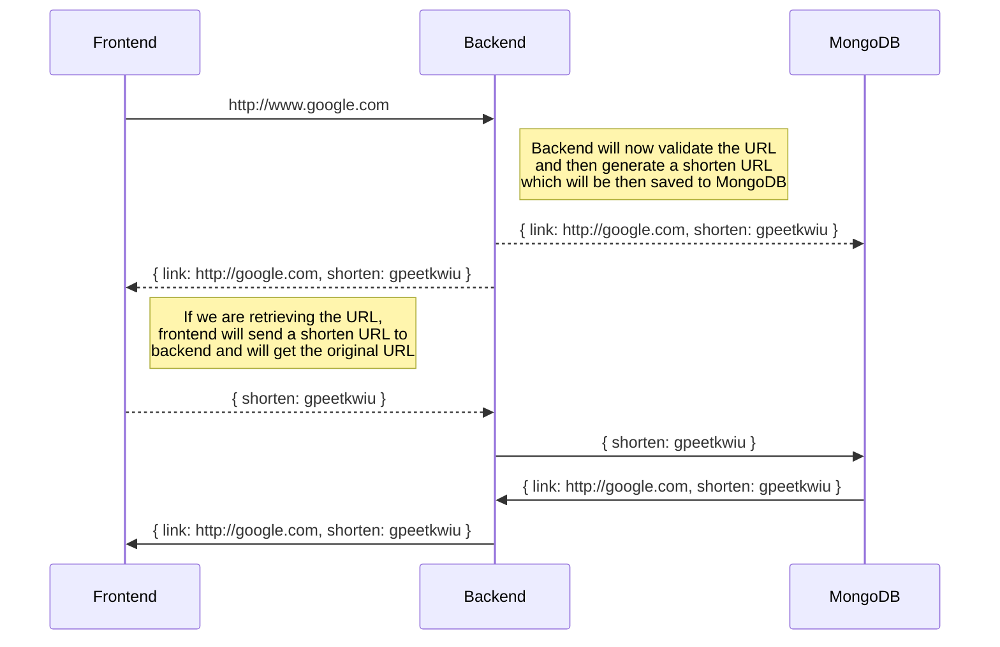

# Shortly - URL Shortner

Shortly is a full-stack application developed using MERN Stack. It uses CRA for the frontend, tailwind CSS for styling, Express.js as a Node.js framework for creating applications, MongoDB to store information.

## Application Architecture

## Running the Application via Docker

Make sure docker is install before running any command and follow these instructions:
1. Navigate to the backend folder
2. Place the .env file with the `MONGO_URI` to connect to MongoDB.
3. Navigate to the root folder
4. Run `docker compose up` from the command prompt while staying in the root folder.
5. Application will be up and running. (Frontend Port: 3000, Backend Port: 3100)

## Running the application in Development Mode

In order to run the application in development mode you have to run the frontend and backend applications separately. 

### Backend Guide
1. Navigate to Backend folder
2. Run `npm install`
3. Add the .env file with the `MONGO_URI` to connect to MongoDB.
4. Once package installation is done, Run `npm run dev`
5. Application will be up and running on port 3100.

### Frontend Guide
1. Navigate to frontend folder
2. Run `npm install`
3. Once package installation is done, Run `npm start`
4. Application will be up and running on port 3000.
